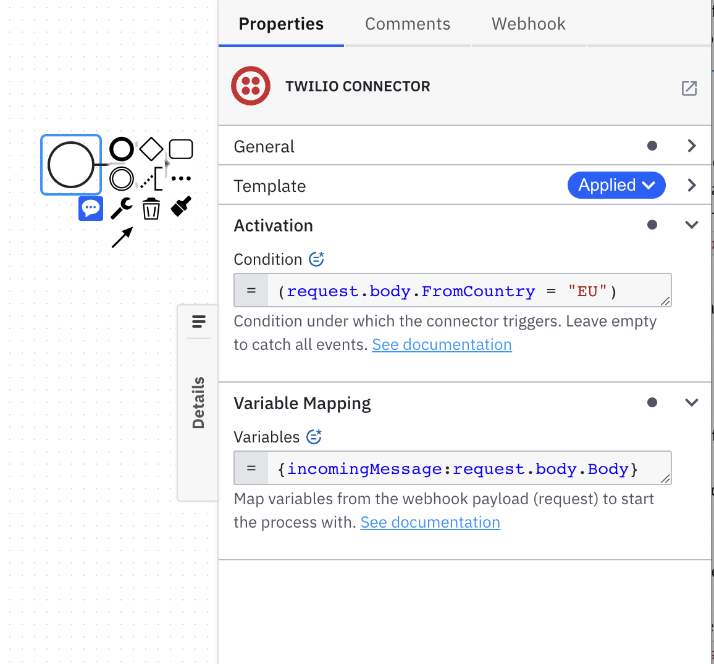

The **Twilio Webhook Connector** is an inbound Connector that allows you to start a BPMN process instance triggered by a [Twilio event](https://www.twilio.com/docs/usage/webhooks).

:::note
If you have used the Twilio Webhook Connector with a Self-Managed Camunda Platform 8 configuration before the Connector SDK [0.7.0 release](https://github.com/camunda/connector-sdk/releases/tag/0.7.0), you might need to manually replace the element template.
Refer to the [update guide](/guides/update-guide/connectors/060-to-070.md) for more details.
:::

## Create a Twilio Webhook Connector task

1. Start building your BPMN diagram with a **Start Event** building block.
2. Change its template to a Twilio Webhook.
3. Fill in all required properties.
4. Complete your BPMN diagram.
5. Deploy the diagram to activate the webhook.
6. Navigate to the **Webhooks** tab in the properties panel to see the webhook URL.

## Make your Twilio Webhook Connector for receiving messages executable

1. In the **Webhook Configuration** section, configure the **Webhook ID**. By default, **Webhook ID** is pre-filled with a random value. This value will be part of the Webhook URL. You will find more details about Twilio Webhook URLs [below](#activate-the-twilio-webhook-connector-by-deploying-your-diagram).
2. Configure **Activation Condition**. For example, given Twilio triggers a webhook endpoint with a new SMS filtering by country `{"body": "{"MessageSid":"SM24111da957", "Body": "Hi Camunda Team", "FromCountry": "EU", ... }"}`, the **Activation Condition** value might look like as `=(request.body.FromCountry = "EU")`. Leave this field empty to trigger your webhook every time.
3. Configure **Variable Mapping**. For example, Twilio triggers a webhook endpoint with a received message `{"body": "{"MessageSid":"SM24111da957", "Body": "Hi Camunda Team", ... }}` and you would like to extract a received message as a process variable `incomingMessage`. In that case, the **Variable Mapping** might look like `={incomingMessage:request.body.Body}`.

## Activate the Twilio Webhook Connector by deploying your diagram

Once you click the **Deploy** button, your Twilio Webhook will be activated and publicly available.

URLs of the exposed Twilio Webhooks adhere to the following pattern:

`http(s)://<base URL>/inbound/<webhook ID>>`

- `<base URL>` is the URL of the Connectors component deployment. When using the Camunda Platform 8 SaaS offering, this will typically contain your cluster region and cluster ID.
- `<webhook ID>` is the ID (path) you configured in the properties of your Twilio Webhook Connector.

If you make changes to your Twilio Webhook Connector configuration, you need to redeploy the BPMN diagram for the changes to take effect.

When you click on the event with the Twilio Webhook Connector applied to it, a new **Webhooks** tab will appear in the properties panel.
This tab displays the URL of the Twilio Webhook Connector for every cluster where you have deployed your BPMN diagram.

:::note
The **Webhooks** tab is only supported in Web Modeler as part of the Camunda Platform 8 SaaS offering.
You can still use Twilio Webhook Connector in Desktop Modeler, or with Camunda Platform 8 Self-Managed.
In that case, Twilio Webhook Connector deployments and URLs will not be displayed in Modeler.
:::

## Configure your Twilio account

To configure your Twilio account for use with the Twilio Webhook Connector, you will need to follow the instructions provided by Twilio for [setting up a webhook](https://www.twilio.com/docs/usage/webhooks/getting-started-twilio-webhooks). Once you have your webhook configured, you can use the webhook URL generated by the Twilio Webhook Connector to receive Twilio events.

## Next steps

- Learn more about [GitHub webhooks](https://docs.github.com/en/developers/webhooks-and-events/webhooks/about-webhooks).
